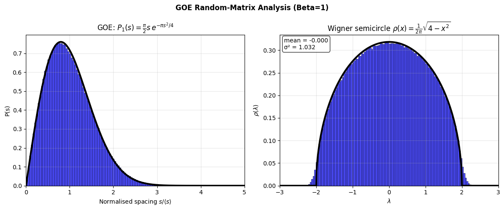
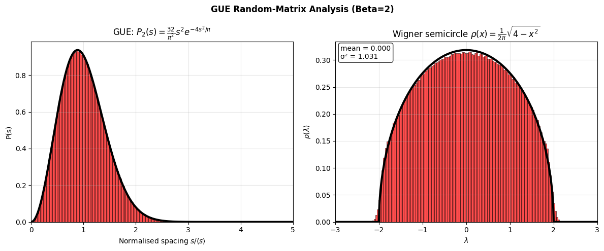
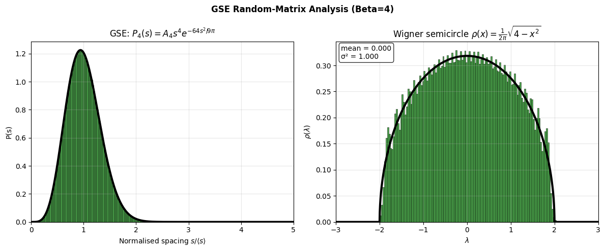
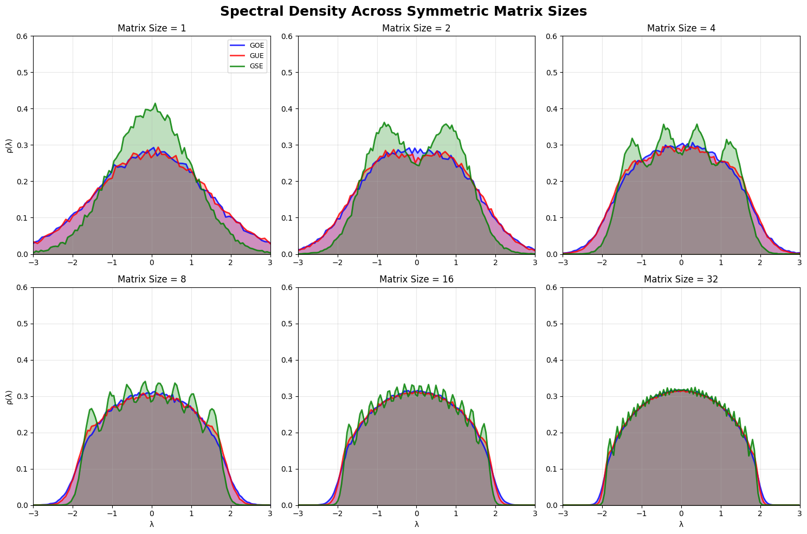

# Random Matrix Theory: Gaussian Ensembles

In this project, we explore Random Matrix Theory and its unique mathematical physics. We demonstrate the universal statistical behavior of eigenvalues in random matrices.
Sampling from 50,000 random matrices across three symmetry classes, we observe quantum chaotic systems and demonstrate identical statistical patterns.
This implementation reveals both Wigner's semicircle law for global eigenvalue density and level repulsion phenomena in local spacing statistics.
These statistical patterns are universal as they depend only on the symmetry class (β), not on the specific distribution used to generate matrix entries.

## Overview

We utilize the three classical ensembles, each representing different quantum mechanical symmetries found in nature, namely Gaussian Orthogonal, Gaussian Unitary, and Gaussian Symplectic.
GOE (Gaussian Orthogonal Ensemble) describes systems with time-reversal symmetry, such as quantum systems with spinless particles or systems where the Hamiltonian commutes with the time-reversal operator T (where T² = +1).
GUE (Gaussian Unitary Ensemble) represents systems without time-reversal symmetry, such as those found in systems with magnetic fields or complex quantum systems.
GSE (Gaussian Symplectic Ensemble) captures systems with time-reversal symmetry but with additional constraints, specifically systems with half-integer spin where T² = -1, leading to Kramers degeneracy.

- **GOE (β=1)**: Gaussian Orthogonal Ensemble - real symmetric matrices
- **GUE (β=2)**: Gaussian Unitary Ensemble - complex Hermitian matrices
- **GSE (β=4)**: Gaussian Symplectic Ensemble - quaternionic matrices

## Key Results

### Individual Ensemble Analysis

Each ensemble demonstrates both global adherence to Wigner's semicircle and local level repulsion:

**Gaussian Orthogonal Ensemble (GOE)**


**Gaussian Unitary Ensemble (GUE)**


**Gaussian Symplectic Ensemble (GSE)**  


The left panels show level spacing distributions demonstrating **level repulsion** - eigenvalues avoid being close together, with the repulsion strength increasing from
GOE (linear) to GUE (quadratic) to GSE (quartic). This repulsion is not a "force", but a geometric effect of RMT. 
The joint eigenvalue density contains a Jacobian factor |λ₁ - λ₂|^β, with a higher β providing more degrees of freedom to keep the eigenvalues spaced apart. The GOE, GUE, and GSE implementations closely fit the Wigner surmise curves.

### Spectral Density Evolution

All three ensembles converge to Wigner's semicircle law as matrix size increases:



This work demonstrates how random fluctuations in small matrices gradually produce Wigner's semicircle. At small N each eigenvalue appears as a distinct bump in the density, but as N grows, these bumps average out by the law of large numbers, ultimately converging to the semicircular limit.

## Mathematical Foundation

### Wigner's Semicircle Law

The eigenvalue density converges to:

```
ρ(x) = (1/2π)√(4-x²) for |x| ≤ 2
```

### Level Spacing Distributions

- **GOE**: P₁(s) = (π/2)s exp(-πs²/4)
- **GUE**: P₂(s) = (32/π²)s² exp(-4s²/π)
- **GSE**: P₄(s) = A₄s⁴ exp(-64s²/9π)

## Citation

If you use this code in your research, please cite:

```bibtex
@software{pjm2025RMT,
  author = {Paul J Mello},
  title = {Random Matrix Theory: Gaussian Ensembles},
  url = {https://github.com/pauljmello/Random-Matrix-Theory},
  year = {2025},
}
```

## References

[1] Wigner, E. P. (1955). Characteristic vectors of bordered matrices with infinite dimensions. *Annals of Mathematics*, 62(3), 548-564.

[2] Mehta, M. L. (2004). *Random Matrices* (3rd ed.). Academic Press.